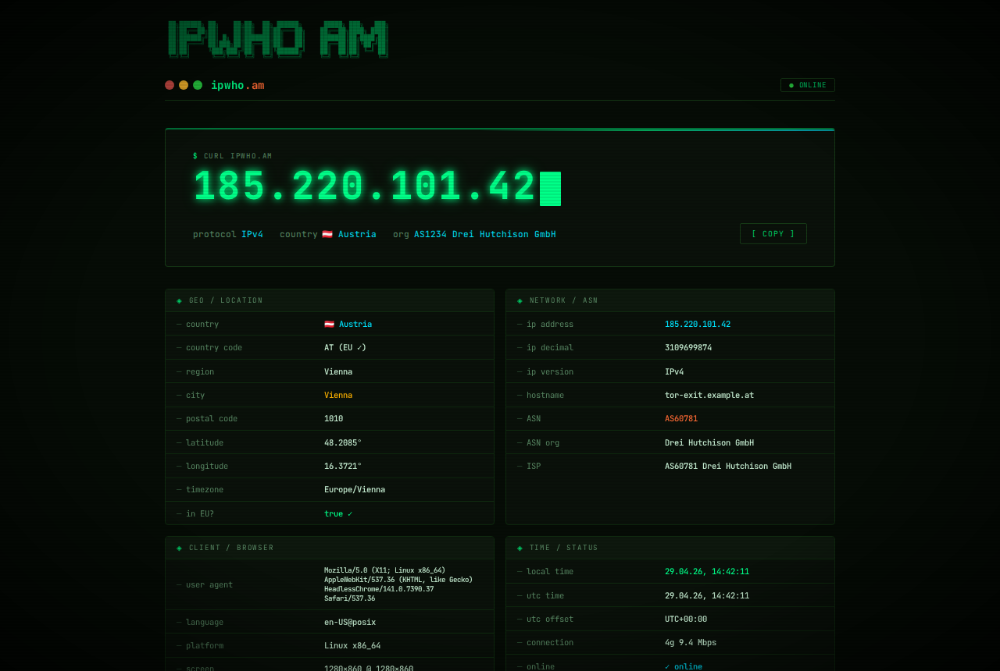

# ipwho.am 🖥️

> **"What is my IP?"** — Self-hostable IP info service with proper PHP backend + MariaDB.  
> `curl ipwho.am` returns your IP. Browser gets a terminal-aesthetic dashboard. All tracked in a real database.




---

## ✨ Features

- **`curl ipwho.am`** → plain IP · **browser** → full HTML dashboard · **`/json`** → JSON
- **All API endpoints** — `/country`, `/city`, `/asn`, `/timezone`, `/8.8.8.8/json` etc.
- **Real database** — every request tracked in MariaDB (country, endpoint, UA, timestamp)
- **Geo caching** — ipapi.co results cached 7 days in DB → no repeated external calls
- **Live stats dashboard** — `/stats` with Chart.js, real data from DB, refreshes every 60s
- **Smart UA detection** — curl/wget/HTTPie get plain text, browsers get HTML
- **DSGVO-konform** — full Datenschutzerklärung, no ad tracking, open source

---

## 🚀 Quick Deploy (Docker)

```bash
git clone https://github.com/MarkysMarks/ipwho.am.git
cd ipwho.am

# Set passwords
echo "DB_PASS=supersecret" > .env
echo "APP_HOST=yourdomain.com" >> .env

# Start
docker compose up -d

# Done → http://localhost
```

The MariaDB schema is auto-imported on first start.

---

## 🖥️ Manual Install (Apache + PHP)

**Requirements:** PHP 8.1+, Apache with `mod_rewrite`, MariaDB/MySQL 10.6+

```bash
# 1. Clone
git clone https://github.com/MarkysMarks/ipwho.am.git /var/www/ipwhoam

# 2. Create DB
mysql -u root -p << 'SQL'
CREATE DATABASE ipwhoam CHARACTER SET utf8mb4;
CREATE USER 'ipwhoam'@'localhost' IDENTIFIED BY 'yourpassword';
GRANT ALL ON ipwhoam.* TO 'ipwhoam'@'localhost';
SQL

# 3. Import schema
mysql -u ipwhoam -p ipwhoam < /var/www/ipwhoam/schema.sql

# 4. Configure
nano /var/www/ipwhoam/config.php
# Set db.host, db.user, db.pass and hostname — that's it

# 5. Apache vhost
cat > /etc/apache2/sites-available/ipwhoam.conf << 'CONF'
<VirtualHost *:80>
    ServerName ipwho.am
    DocumentRoot /var/www/ipwhoam
    <Directory /var/www/ipwhoam>
        AllowOverride All
        Require all granted
    </Directory>
</VirtualHost>
CONF

a2ensite ipwhoam
a2enmod rewrite
systemctl reload apache2
```

---

## 🔌 API Endpoints

All endpoints support `Accept: application/json` header and work with curl/wget/HTTPie.

| Method | Endpoint | Response |
|--------|----------|----------|
| GET | `/` | Plain IP (CLI) or HTML page (browser) |
| GET | `/json` | Full JSON with all fields |
| GET | `/country` | Country name (plain text) |
| GET | `/country-iso` | ISO 3166 country code |
| GET | `/city` | City name |
| GET | `/region` | Region / state |
| GET | `/asn` | ASN number |
| GET | `/org` | Organization / ISP |
| GET | `/timezone` | Timezone string |
| GET | `/hostname` | Reverse DNS hostname |
| GET | `/{ip}/json` | Look up any IP address |
| GET | `/api/stats` | Raw stats JSON (used by dashboard) |

```bash
# Examples
curl ipwho.am                    # your IP
curl ipwho.am/json               # full JSON
curl ipwho.am/country            # "Germany"
curl ipwho.am/8.8.8.8/json       # look up Google DNS
curl -H "Accept: application/json" ipwho.am  # force JSON
```

---

## 📁 Project Structure

```
ipwho.am/
├── index.php          # Main router — all API + HTML logic
├── stats.php          # Live traffic dashboard
├── datenschutz.php    # GDPR privacy page
├── config.php         # Default configuration
├── config.local.php   # Local overrides (gitignored)
├── schema.sql         # MariaDB schema (3 tables)
├── lib/
│   ├── DB.php         # PDO wrapper
│   ├── GeoLookup.php  # IP geo with 7-day DB cache
│   └── Tracker.php    # Request logger → DB
└── .htaccess          # Apache URL rewriting
```

---

## 🗄️ Database Schema

Three tables:

- **`visits`** — every request: IP, endpoint, UA, country, timestamp, response_ms
- **`geo_cache`** — ipapi.co results cached by IP (7 days TTL)
- **`daily_stats`** — pre-aggregated daily counters (web/api/cli hits)

---

## 🎨 Design

Terminal Cyberpunk — phosphor green on near-black, CRT scanlines, ASCII art header, JetBrains Mono throughout.

---

## 📄 License

MIT — use freely, attribution appreciated.

## 🙏 Credits

- Inspired by [ifconfig.co](https://ifconfig.co) by [@mpolden](https://github.com/mpolden)
- Geo data: [ipapi.co](https://ipapi.co) / MaxMind GeoLite2
- Font: [JetBrains Mono](https://www.jetbrains.com/lp/mono/)
